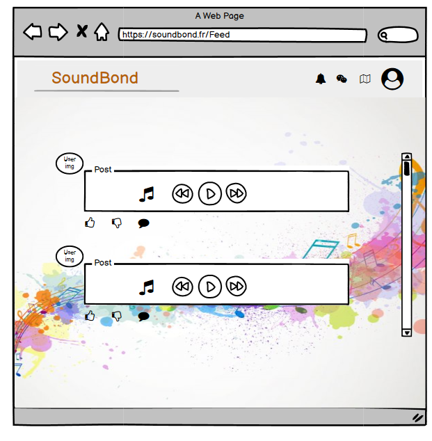
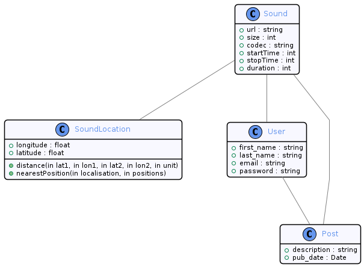

= SoundBond (SB) Documentation
2021-10-04

== Synthèse
=== L'équipe
L'équipe est composée de Maguette Diop, Paul Malinvaud, Mohamed Belhaimeur, Guilhem Tissot ainsi que, depuis plus récemment, d'Hajar Salhi.

=== Le projet
Le projet SoundBond a été pensé en analogie avec un réseau social comme Instagram. Ce dernier est omniprésent aujourd'hui et il paraît tout à fait naturel d'immortaliser ses souvenirs avec une photo de son plat, à la plage ou avec ses amis. En regardant les réseaux sociaux déjà existants nous nous sommes dit que personne ne jouait exclusivement sur l'aspect du son. Il a l'avantage de pouvoir offrir un nouveau regard sur les souvenirs immortalisés et à l'avenir nous aimerions bien que l'application serve à transformer chaque utilisateur en DJ du quotidien.

// problématique et gain attendu, motivation de l'équipe par rapport au sujet, concurrence / état de l'art de l'existant et placement par rapport à cela

=== Les personas
==== Utilisateur Instagram de longue date
En tant qu'utilisateur d'Instagram, je m'attends à retrouver des fonctionnalités que je connais comme la messagerie, le fil d'actualités ou encore l'onglet Explorer. Je m'attends également à pouvoir modifier les sons que j'enregistre à la manière des filtres pour les photos Instagram. Il faut que ce soit retouché pour que ce soit beau.

==== Musicien
En tant que musicien, je m'attends à pouvoir partager mes compositions. Une communauté pourrait faire marcher le bouche à oreille et me permettre de gagner en notoriété. Je peux réaliser des vidéos avec Instagram mais préfère être jugé sur le son et seulement le son.

==== Bruiteur 
En tant que bruiteur, je m'attends à pouvoir partager mes créations. Celles-ci apparaissent d'habitude dans les films sans que personne ne sache que c'était moi qui est derrière ces sons, qui ont été enregistrés en studio. Je m'attends donc à pouvoir faire gagner en visibilité mon métier grâce à ce réseau en faisant par exemple des sortes de BlindTest mais pour des bruits connus du cinéma. 

==== Nouvel arrivant sur les réseaux sociaux
En tant que nouvel arrivant sur les réseaux sociaux, je m'attends à pouvoir partager du contenu avec mes amis ainsi que voir ce qu'ils publient. Je voudrais également pouvoir suivre des artistes du son. 

=== Prévisions marketing
Nous prévoyons de pousser notre projet auprès des utilisateurs par des promotions sur Internet. 
Mocha
== Aspect techniques
=== Type d'application
L'application sera d'abord une web-application jusqu'à que le backend soit entièrement fonctionnel. Nous imaginons ensuite la possibilité de réaliser une application mobile en React Native.

=== Schéma architectural
Le schéma architectural suit le modèle MERN. MERN pour MongoDB, "`Express`" <<express>>, "`ReactJS`" <<reactjs>>  et "`NodeJS`" <<nodejs>>. Nous avons d'abord commencé avec cette architecture classique puis nous sommes passés de MongoDB à MySQL (et de l'ODM - Object Document Mapper - Mongoose à l'ORM - Object Relational Mapper - Sequelize) car n'appréciant pas l'aspect (et les contraintes) de MongoDB - celui-ci étant NoSQL. La base est stockée sur le même serveur que la WebApp mais pourra être externalisé.

Dans notre cas, nous avons deux modèles de persistance de données, celle de nos classes comme les utilisateurs, les sons sociaux, etc... puis les sons en tant que ressource. Ces derniers seront, dans l'idéal, stockés sur un BLOB, avec l'URL de chaque fichier conservé dans notre base de données. Dans un premier temps, ils seront conservés sur le serveur de la WebApp. Nous avons décidés de nous lancer dans une application de structure MERN car nous avions tous déjà une expérience sur une WebApp mais pas avec les mêmes langages, l'un avait utilisé ReactJS en front et Python en back, un autre Angular et Java, etc... Nous voulions découvrir une nouvelle architecture avec le projet et avons donc décidés de partir sur du MERN, architecture très populaire. 

=== Plateforme technologique
Avec ReactJS en _frontend_ et NodeJS en _backend_, nous utilisons presque uniquement JavaScript. Pour les frameworks de tests nous allons utiliser "`Mocha`" <<mocha>> et "`Chai`" <<chai>> pour la lib d'assertions. Nous avons choisi ces frameworks car ils nous semblaient qu'ils étaient les plus utilisés dans l'architecture que nous avions choisie. 

=== Plateforme opérationnelle
Nous utilisons GitHub Project (kanban équipe) ainsi qu'un board Jira (kanban client) pour nous coordonner. Nous utilisions précédemment GitHub Project pour le kanban client et Jira pour celui de l'équipe de développement, puis nous avons échangé les plateformes afin de pouvoir générer des _burn-down ou burn-up charts_ pour le client, et de pouvoir référencer nos commits avec nos _issues_ plus facilement. Pour communiquer autour du projet nous utilisons Slack, qui a l'avantage de pouvoir être relié à toutes les autres applications que nous utilisons pour le projet (Jira, Travis, etc...).
Notre projet se trouve sur GitHub et nous faisons de l'analyse de qualité de code avec SonarCloud. Concernant notre système de build, nous travaillons en ce moment même sur gulp qui possède de nombreux plugins. Enfin l'intégration continue se fait dans un premier temps avec Travis CI car nous avions de l'expérience dessus mais nous envisageons d'essayer dans le futur un autre serveur d'intégration continue comme GitHub Actions par exemple.

=== Interconnection avec systèmes et API distantes

Pour les cartes, nous utilisons l'API gratuite de "`MapBox`" <<mapbox>>.

=== Acquisition de données et usage intelligent

Partage de données avec BirdNet ?

== Modélisation - v0.3

=== Maquette du front 

==== WF0.1 Feed 

la page d'accueil est accessible en cliquant sue le nom de la plateforme "SoundBond" situé dans la navbar en haut à gauche et contient les posts de l'utilisateur ainsi que les posts de personnes qu'il suit

Scénarios 

1. L'utilisateur est connecté et souhaite défiler lle contenu de son fil d'actualité
2. L'utilisateur trouvera sur cette page les posts qui l'a créé lui même ou ceux créer par les personnes qu'il follow , il pourra liker ou commenter ces posts
3. L'icone sous forme d'une clôche permettra à l'utilisateur de voir ces nouvelles notifications
4. Cliquer sur l'icone map  redirigera l'utilisateur vers la page soundLocation dans laquelle les sons sont positionner sur une carte   
5. L'utilisateur pourra se déconnecter grâce à l'icone du bonhomme  sur la navbar en haut à gauche 

==== WF0.1 Profil 

image::assets/Profil.png[]
la page Profil est ouverte aprés le login de l'utilisateur et lui permet de créer des nouveaux posts et les partager ainsi que revoir ses anciens posts 

Scénarios 

1. L'utilisateur pourra créer un post en ajoutant un son et une description et le partager avec les personnes qui le suivent en cliquant sur le bouton share
2. La page est mis à jour à chaque création d'un nouveau post
3. L'utilisateur dispose toujours d'une navbar qui facilite la navigation sur le site

==== WF0.1 SoundLocation
image::assets/SoundLocalisation.png[]

Cette page regroupe les sons enregistés positionner sur une carte et permet à l'utilisateur de chercher un son selon sa position

=== Diagramme de classes global

----

@startuml SoundBond
!include ./commons.style

class Sound {
    #url : string
    #size : int 
    #codec : string
    #startTime : int
    #stopTime : int
    #duration : int
}

class SoundLocation {
    #longitude : float
    #latitude : float
}

class User {
    #first_name : string
    #last_name : string
    #email : string
    #password : string
}

class Post  {
    #description : string
    #pub_date : Date
}

User -- Post
Post -- Sound
Sound -- SoundLocation

@enduml
----
=== Description API back (ex REST)

=== Diagramme de séquences des intercations front/back

// (par feature, voir le back comme une boîte noire)

[bibliography]
== Références

* [[[mocha]]] https://mochajs.org/[Mocha], " a feature-rich JavaScript test framework running on Node.js and in the browser, making asynchronous testing simple and fun. "
* [[[chai]]] https://www.chaijs.com/[Chai], " a BDD / TDD assertion library for node and the browser that can be delightfully paired with any javascript testing framework. "
* [[[expres]]] https://expressjs.com/[Express], " a minimal and flexible Node.js web application framework that provides a robust set of features for web and mobile applications. "
* [[[reactjs]]] https://fr.reactjs.org/[ReactJS], " une bibliothèque JavaScript pour la construction d’interfaces utilisateur (UI). "
* [[[nodejs]]] https://nodejs.dev/[Node.js], " a free, open-sourced, cross-platform JavaScript run-time environment that lets developers write command line tools and server-side scripts outside of a browser. "
* [[[mapbox]]] https://fr.wikipedia.org/wiki/Mapbox[MapBox], " une entreprise américaine spécialisée dans la cartographie en ligne. Elle fournit les cartes de sites, services et médias tels que Foursquare, Pinterest, The Financial Times, Etsy, Le Monde et Snapchat. Mapbox développe un ensemble de technologies et d’outils cartographiques, dont la bibliothèque Mapbox.js "
